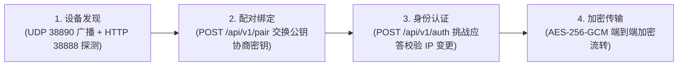
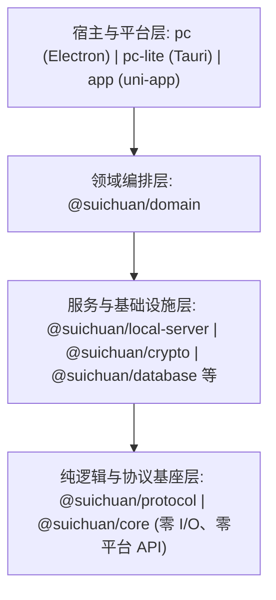

<div align="center">
  <a href="https://suichuan.zxlee.cn" target="_blank" rel="noopener noreferrer">
    
  </a>
  <h1 align="center">随传 (SuiChuan)</h1>
  <p align="center"><b>自在互联，随传而至。</b></p>
  <p align="center">跨平台局域网多设备协作工具 — 极速文件传输 · 剪贴板自动同步 · 局域网即时消息</p>
  <p align="center">
    <a href="./LICENSE"></a>
    <a href="#"></a>
    <a href="#"></a>
  </p>
  <p align="center">
    <a href="https://suichuan.zxlee.cn">官方网站</a> · 
    <a href="https://suichuan.zxlee.cn/#download">软件下载</a> · 
    <a href="./docs/README.md">开发文档</a> · 
    <a href="https://suichuan.zxlee.cn/feedback/">意见反馈</a>
  </p>
</div>

---

> 💡 **项目说明**：随传是一款完全去中心化、离线可用的局域网协作工具。数据仅在自有设备间点对点流转，无任何云端中转或账号体系。全套设计与协议契约文档详见 [`docs/`](./docs/) 目录。

---

## 目录

- [项目简介](#项目简介)
- [核心特性](#核心特性)
- [平台支持](#平台支持)
- [技术架构](#技术架构)
  - [连接与安全握手流程](#连接与安全握手流程)
  - [分层与三端分工](#分层与三端分工)
- [开发文档总览](#开发文档总览)
- [Monorepo 仓库结构](#monorepo-仓库结构)
- [开源计划与路线图](#开源计划与路线图)
- [参与贡献](#参与贡献)
- [许可证](#许可证)

---

## 项目简介

**随传（SuiChuan）** 是一款无广告、零云端、离线可用的局域网多设备协作工具。它解决了多台电脑与手机之间相互传输文件、同步剪贴板以及临时即时沟通的痛点。

- **零云端中转**：设备间利用点对点 HTTP/1.1 与 UDP 局域网协议直连传输，数据不出局域网；
- **端到端加密**：首次配对即完成 X25519 ECDH 密钥协商，业务数据全流程 AES-256-GCM 加密保护；
- **开箱即用**：免账号注册，支持局域网自动扫描、扫码绑定、手动 IP 连通及网页免安装提取码分享。

---

## 核心特性

| 特性 | 说明 | 关联文档 |
| :--- | :--- | :--- |
| **局域网极速直传** | 4 MiB 分片最多 4 路并发传输，不限文件体积，支持断点续传与两层 SHA-256 校验 | [`docs/data-transfer.md#6-文件传输`](./docs/data-transfer.md#6-文件传输) |
| **局域网即时对话** | 点对点加密收发文本与文件卡片，支持倒计时阅后即焚 | [`docs/data-transfer.md#4-聊天消息`](./docs/data-transfer.md#4-聊天消息) |
| **剪贴板自动同步** | 跨设备剪贴板实时同步，一处复制多端粘贴；内置回环抑制引擎，防止死循环 | [`docs/data-transfer.md#5-剪贴板同步`](./docs/data-transfer.md#5-剪贴板同步) |
| **免安装网页提取码** | 接收端无需安装应用，浏览器扫码凭提取码下载；支持手动审批与一次性凭据 | [`docs/data-transfer.md#7-网页提取码分享`](./docs/data-transfer.md#7-网页提取码分享) |
| **多通道设备发现** | UDP 广播与 HTTP 逐 IP 探测双通道并行，智能网卡筛选与无感 IP 跟随 | [`docs/device-discovery.md`](./docs/device-discovery.md) |
| **端到端安全防御** | X25519 密钥协商、挑战-应答身份认证 (`/api/v1/auth`) 与隐身模式防冒充 | [`docs/device-pairing.md`](./docs/device-pairing.md) · [`docs/identity-auth.md`](./docs/identity-auth.md) |
| **全平台轻量覆盖** | 原生跨平台架构，涵盖 macOS、Windows、Linux、iOS、Android | [`docs/conventions.md#8-平台注意事项`](./docs/conventions.md#8-平台注意事项) |

---

## 平台支持

| 平台 | 最低版本要求 | 核心技术栈 | 状态 |
| :--- | :--- | :--- | :--- |
| **Windows** | Windows 10 (64 位) | Electron (PC) / Tauri v2 (PC-Lite) | 已支持 |
| **macOS** | macOS 11.0 (Big Sur) | Electron (PC) / Tauri v2 (PC-Lite) | 已支持 |
| **Linux** | 主流 Linux 发行版 | Electron (PC) / Tauri v2 (PC-Lite) | 已支持 |
| **iOS** | iOS 14.0 | uni-app / Vue 3 / UTS | 已支持 (App Store) |
| **Android** | Android 5.0 (API 21) | uni-app / Vue 3 / UTS | 已支持 |
| **HarmonyOS** | 鸿蒙原生 | UTS / OpenHarmony 原生 | 规划中 |

---

## 技术架构

### 连接与安全握手流程

随传建立信任与传输数据的完整生命周期分为 4 个核心阶段：



| 阶段 | 环节 | 说明 | 对应文档 |
| :--- | :--- | :--- | :--- |
| **1** | [设备发现](./docs/device-discovery.md) | UDP 38890 广播与 HTTP 38888 逐 IP 扫描双通道并行，智能筛选真实物理网卡并合并去重 | [`docs/device-discovery.md`](./docs/device-discovery.md) |
| **2** | [配对绑定](./docs/device-pairing.md) | 发起 `POST /api/v1/pair`，对端弹窗确认后交换 X25519 公钥；双方各自经 ECDH 派生 TransportKey，公钥不在网络明文出库 | [`docs/device-pairing.md`](./docs/device-pairing.md) |
| **3** | [身份认证](./docs/identity-auth.md) | 发起 `POST /api/v1/auth` 7 位随机串挑战，防止局域网攻击者冒充设备 ID 劫持流量 | [`docs/identity-auth.md`](./docs/identity-auth.md) |
| **4** | [数据传输](./docs/data-transfer.md) | 承载消息、剪贴板与分片文件；单片 (`X-Chunk-Sha256`) 与全文件 (`X-File-Sha256`) 双重哈希校验，支持断点续传 | [`docs/data-transfer.md`](./docs/data-transfer.md) |

### 分层与三端分工

项目采用严格的 4 层单向依赖架构，通信协议、加密算法、状态机与数据库 Schema 均下沉至 `packages/` 共享包，实现业务与平台彻底解耦：



| 端 | 运行环境 | UI 框架 | 加密实现 | 存储方案 | 详细说明 |
| :--- | :--- | :--- | :--- | :--- | :--- |
| **PC** (Electron) | Electron + Node.js | Vue 3 + Element Plus | Node.js `crypto` | `better-sqlite3` | [`docs/conventions.md#83-pcelectron`](./docs/conventions.md#83-pcelectron) |
| **PC-Lite** (Tauri) | Tauri v2 + Rust | Vue 3 + Element Plus | Rust (`aes-gcm`, `x25519-dalek`) | `rusqlite` | [`docs/conventions.md#81-pc-litetauri--rust`](./docs/conventions.md#81-pc-litetauri--rust) |
| **App** (uni-app) | uni-app / UTS Native | Vue 3 + Wot Design Uni | Noble Crypto (`@noble/*`) | `uni.openDatabase` | [`docs/conventions.md#82-appuni-app--uts`](./docs/conventions.md#82-appuni-app--uts) |

有关架构分层约束的详细规则，请参阅 [`docs/conventions.md`](./docs/conventions.md#1-分层与依赖方向)。

---

## 开发文档总览

随传包含完整的规范与设计文档，存放于 [`docs/`](./docs/) 目录：

| 文档 | 说明 | 重点覆盖内容 |
| :--- | :--- | :--- |
| 📖 [开发文档主页](./docs/README.md) | 总体索引与维护约定 | 推荐阅读顺序、文档定位与维护规范 |
| 📑 [API 接口文档](./docs/API.md) | 设备间 HTTP / UDP 规范 | 路径、请求头、统一响应信封、错误码表、UDP 报文 |
| 🔍 [局域网设备发现](./docs/device-discovery.md) | 广播与扫描机制 | 双通道扫描、网卡筛选、心跳在线判定、IP 跟随流程 |
| 🤝 [设备配对与绑定](./docs/device-pairing.md) | 信任建立与密钥协商 | X25519 ECDH 协商、三种连接入口、IP 冲突处理、解绑与黑名单 |
| 🛡️ [设备身份认证](./docs/identity-auth.md) | 安全防御机制 | 挑战-应答协议、AES-GCM 证明解密与三重比对、失败语义 |
| 📦 [数据传输](./docs/data-transfer.md) | 消息/剪贴板/文件传输 | 端到端加密线格式、聊天自毁、剪贴板回环抑制、4 MiB 分片与续传、网页提取码 |
| 📐 [设计规范与工程约定](./docs/conventions.md) | 代码规范与跨端约定 | 4 层依赖方向、Fail-closed 原则、死锁防护、三端平台注意事项 |

推荐阅读顺序：**[设备发现](./docs/device-discovery.md) → [配对绑定](./docs/device-pairing.md) → [身份认证](./docs/identity-auth.md) → [数据传输](./docs/data-transfer.md)**。

---

## Monorepo 仓库结构

仓库基于 `pnpm workspace` 构建：

```
suichuan/
├── packages/              跨端共享包 (与平台无关)
│   ├── protocol/          通信协议唯一真源 (路由、头名、ErrorCode、能力位)
│   ├── core/              纯逻辑与状态机 (Heartbeat、Transfer 状态机、ID 生成)
│   ├── crypto/            端到端加密基元 (X25519、HKDF、AES-256-GCM Provider)
│   ├── database/          SQLite Schema、迁移语句与实体映射
│   ├── domain/            领域编排 (设备、配对、认证、消息、传输、剪贴板)
│   ├── local-server/      本地 HTTP 端点业务处理器与路由
│   ├── share/             网页提取码分享与审批流引擎
│   ├── transport-node/    Node.js 传输层适配器
│   └── branding/          品牌静态资源与主题
│
├── pc/                    Electron 桌面端 (全功能版)
├── pc-lite/               Tauri 2.0 桌面端 (Rust 轻量版)
├── app/                   uni-app 移动端 (iOS / Android / 原生 UTS 插件)
├── official-site/         Astro 官方网站
├── docs/                  开发与架构规范文档
└── deploy/                构建与打包部署脚本
```

---

## 开源计划与路线图

目前随传核心架构重构与三端解耦工作已全部完成：

| 阶段 | 内容 | 状态 |
| :--- | :--- | :--- |
| **架构解耦** | 将协议、加密、数据库、传输、分享引擎拆分为 9 个 `packages/` 共享包 | 已完成 |
| **三端重构** | Electron 版、Tauri 轻量版与 uni-app 移动端全部对接共享包 | 已完成 |
| **跨端功能完善** | 剪贴板回环抑制、多网卡地址跟随、免安装网页提取码迭代 | 进行中 |
| **开源发布** | 仓库完整公开，接受社区 Issue 与 Pull Request | 准备中 |

---

## 参与贡献

- **反馈缺陷**：[GitHub Issues](https://github.com/SmileZXLee/suichuan-open/issues)
- **功能建议**：[GitHub Discussions](https://github.com/SmileZXLee/suichuan-open/discussions)
- **文档补充**：若发现文档中存在描述错漏，欢迎提交 PR
- **联系我们**：[admin@zxlee.cn](mailto:admin@zxlee.cn) · [官方网站](https://suichuan.zxlee.cn) · [意见反馈](https://suichuan.zxlee.cn/feedback/)

---

## 许可证

项目采用 [MIT License](./LICENSE) 协议开源。

<div align="center">
<sub><b>随传 · SuiChuan</b> — 自在互联，随传而至。</sub>
</div>
