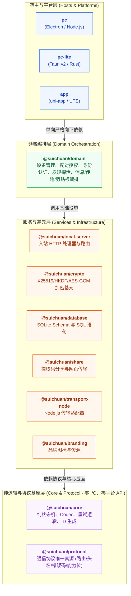

# 设计规范与工程约定

## 目录

- [1. 分层与依赖方向](#1-分层与依赖方向)
  - [1.1 依赖规则](#11-依赖规则)
  - [1.2 共享逻辑的判定标准](#12-共享逻辑的判定标准)
- [2. 线格式](#2-线格式)
- [3. 安全约定](#3-安全约定)
  - [3.1 明文字段不作身份凭据](#31-明文字段不作身份凭据)
  - [3.2 fail-closed](#32-fail-closed)
  - [3.3 密钥分层](#33-密钥分层)
  - [3.4 敏感操作入口收敛](#34-敏感操作入口收敛)
  - [3.5 路径与文件名清洗](#35-路径与文件名清洗)
- [4. 并发与阻塞](#4-并发与阻塞)
- [5. 状态与持久化](#5-状态与持久化)
- [6. 设置项约定](#6-设置项约定)
- [7. 可观测性](#7-可观测性)
- [8. 平台注意事项](#8-平台注意事项)
  - [8.1 pc-lite（Tauri / Rust）](#81-pc-litetauri--rust)
  - [8.2 app（uni-app / UTS）](#82-appuni-app--uts)
  - [8.3 pc（Electron）](#83-pcelectron)
- [9. 相关文档](#9-相关文档)

---

本文汇总仓库内的跨端约定，适用于新增功能与跨端改动。

---

## 1. 分层与依赖方向



### 1.1 依赖规则

1. 依赖只能自上而下，不存在反向依赖或跨端横向依赖。`pc` 不引用 `app` 的代码，反之亦然。
2. `protocol` 与 `core` 保持零 I/O、零平台 API，可在 Node、浏览器、uni-app、小程序等任意运行时求值。
3. `local-server` 的 handler 只做判断，全部 I/O（文件、数据库、通知、窗口）通过参数注入。
4. 平台差异通过依赖注入解决，不使用条件编译或按平台分支的业务逻辑。

### 1.2 共享逻辑的判定标准

存在第二个端会使用同一段判断时，该逻辑下沉至 `packages/`。

同一段逻辑在两端各自实现时，一端修改而另一端未同步即产生协议漂移。

现有的下沉示例：

| 逻辑 | 位置 |
| :--- | :--- |
| 出站请求信封构造与响应解析 | `protocol/client-request.ts` |
| 在线判定状态机 | `core/state-machines/heartbeat.ts` |
| 配对决策与 ECDH 派生 | `local-server/pairing-service.ts` |
| 身份认证契约、应答与挑战 | `protocol/messages/auth.ts`、`local-server/handlers/auth.ts`、`domain/auth/` |
| 私网与虚拟网卡判定 | `local-server/ip-utils.ts` |
| 分片布局校验、ID 生成规则 | `protocol/file-chunk.ts`、`core/utils/id.ts` |

pc-lite 的 Rust 侧无法直接引用 TS 包，其实现为按同一契约的等价实现。此类情况下契约文档与常量取值逐字对齐（HKDF 参数、错误码字面量、字段名、随机串规则），并在两侧注释中互相指认。

---

## 2. 线格式

`@suichuan/protocol` 是设备间通信的唯一真源，涵盖路径、请求与响应字段、请求头名、错误码、能力位。

1. 不在业务代码中硬编码请求头名或错误码字符串，统一使用 `LEGACY_HEADERS`、`FILE_CHUNK_HEADERS`、`ErrorCode`。
2. 新增错误码同时更新三处：`ErrorCode` 枚举、`ERROR_HTTP_STATUS` 映射、`error-messages.ts` 中文文案。
3. 改动线格式前确认三端同步；无法同步时按「新增可选字段」的方式保持向后兼容。

统一响应信封：成功为 `{ success: true, data }`，失败为 `{ success: false, code, message?, details? }`。HTTP 状态码由 `ErrorCode → status` 映射表推导，不手写。客户端按 `code` 分支，`message` 不参与判定。

---

## 3. 安全约定

### 3.1 明文字段不作身份凭据

`X-Source-Device-Id` 为明文，仅用于准入过滤。基于「对端是谁」作出的安全决策（典型为设备 IP 更新）执行[身份认证](./identity-auth.md)。数据自身的真实性由端到端加密的认证标签保证。

### 3.2 fail-closed

验证失败、密钥缺失、请求超时、对端版本不支持等情形，一律按未通过处理并保持现状。

不引入用于兼容的放行分支。「对端返回 404 即跳过验证」这类分支等价于攻击者返回 404 即可绕过整套机制。旧版本对端的表现为不产生错误且功能不生效。

### 3.3 密钥分层

数据库中存储的是传输密钥；业务与认证使用的是再混入应用内置密钥与用户私人密钥派生出的最终密钥。新增的加解密场景使用最终密钥，不直接取用数据库中的值；数据库中的传输密钥单独无法解密流量或伪造身份。

### 3.4 敏感操作入口收敛

会影响后续全部数据流向的操作（典型为 IP 更新），入口保持唯一：渲染层不直接执行，统一由主进程或 store 的单一函数在验证通过后执行。

### 3.5 路径与文件名清洗

来自网络的文件名与设备 ID 在参与文件系统路径前，经 `sanitizeFileName` 或 `sanitizeDeviceId` 处理（`@suichuan/local-server/path-utils`），以防目录穿越。重名文件按 `(1)`、`(2)` 递增，不覆盖已有文件。

---

## 4. 并发与阻塞

| 规则 | 违反后的后果 |
| :--- | :--- |
| 不在持锁期间执行网络 I/O | 对端不可达时全局数据库锁被占满，应用整体无响应 |
| 阻塞调用不占用异步运行时 worker | 并发若干不可达目标即可占满 worker，全部 IPC 无法排入 |
| 长任务置于独立线程 | 文件合并与 SHA-256 计算阻塞 UI 事件循环 |
| 网络请求设置超时 | 悬挂连接长期占用资源 |
| 同目标并发请求去重 | 单轮扫描中同一设备被多路触发，重复发送相同请求 |
| 失败设置冷却 | 热路径（如逐分片触发）上失败无冷却将形成请求风暴 |

异步回调返回后重新确认前置条件仍然成立（设备是否仍在绑定列表、状态是否已被其它路径修改），不以等待前的快照写库。

---

## 5. 状态与持久化

1. 数据库为权威数据源，内存缓存为其投影。写操作先落库，再更新缓存与界面。
2. pc 与 pc-lite 由主进程持有数据库连接，渲染层经 IPC 读写，不直接访问。
3. 启动时将全部设备状态重置为 `offline`，由心跳确认真实状态，避免展示上次退出时的残留状态。
4. Schema 变更经 `@suichuan/database` 进行，并处理已有用户的数据迁移。

---

## 6. 设置项约定

设置项以 `set-` 前缀存储于 KV 表，取值统一为字符串：`"true"`、`"false"` 或数字字符串。

读取时显式指定默认值，同一设置项在三端的默认值一致：

```ts
// 默认开启
const enabled = value !== 'false'
// 默认关闭
const enabled = value === 'true'
```

一端使用 `value === 'true'`（缺失时为 `false`）、另一端使用 `value !== 'false'`（缺失时为 `true`）时，同一开关在两端行为相反。

影响后台行为的设置项（自动扫描、扫描间隔、自动更新 IP、允许明文、隐身模式、端对端加密、私人密钥）在主进程侧同样可读，不仅保存于渲染层内存。

---

## 7. 可观测性

约定如下：

1. 每条自动化链路输出一行可判定的日志，包含触发来源、观测到的输入、所作决定。缺少该日志时，「未执行到该处」「设置已关闭」「未扫描到设备」「未匹配到绑定记录」四种情形无法区分。
2. 日志前缀统一为 `[模块名]`，并标明触发来源，例如 `[BGScan]`、`[ManualScan]`、`[InboundIP]`。
3. 区分预期失败与可疑失败：对端版本不支持属预期情况，使用普通级别；验证未通过使用告警级别。
4. 不吞掉错误。`if let Ok(x) = ...` 与 `catch {}` 丢弃错误时，至少保留一行日志。
5. 长驻后台线程设置 panic 兜底。缺少兜底时一次 panic 即使该链路永久失效，而进程仍然存活、其它路径正常。

---

## 8. 平台注意事项

### 8.1 pc-lite（Tauri / Rust）

1. IPC 命令的阻塞分发置于 blocking 线程池。
2. `async` 命令不在主线程执行；Tauri v2 下窗口操作可跨线程调用。
3. 常量取值（HKDF 参数、错误码、协议字段）与 TS 侧逐字对齐。

### 8.2 app（uni-app / UTS）

1. 仅从 node-free 子路径导入共享包，例如 `@suichuan/crypto/noble`、`@suichuan/domain/auth`。根 barrel 可能引入 `node:crypto` 等模块，在 APP-PLUS 运行时不可用。
2. App-Plus 构建产物为单个 IIFE，不支持 code-splitting，因此不能使用动态 `import()` 懒加载。
3. UTS 调用原生闭包存在两项限制：单次调用只能可靠传入一个闭包，且位于最后一个参数位；需要多路结果时使用「单回调加参数区分」。平台类型（如 `Int`）不作为 UTS 变量的类型标注，使用 number 并在调用处 `.toInt()` 转换。
4. 异步原生 API 不按同步语义使用。iOS 的 `NWListener.start()` 为异步绑定，端口被占用时不抛出异常，而是进入 `waiting` 状态并自行重试，须监听状态回调取得绑定结果。

### 8.3 pc（Electron）

1. 主进程持有数据库与网络，渲染层仅通过 IPC 访问。
2. 原生模块（`better-sqlite3`）在 Electron 或 Node 版本变化后重新编译。

---

## 9. 相关文档

- [API 接口文档](./API.md)
- [局域网设备发现](./device-discovery.md)
- [设备配对与绑定](./device-pairing.md)
- [设备身份认证](./identity-auth.md)
- [数据传输](./data-transfer.md)
