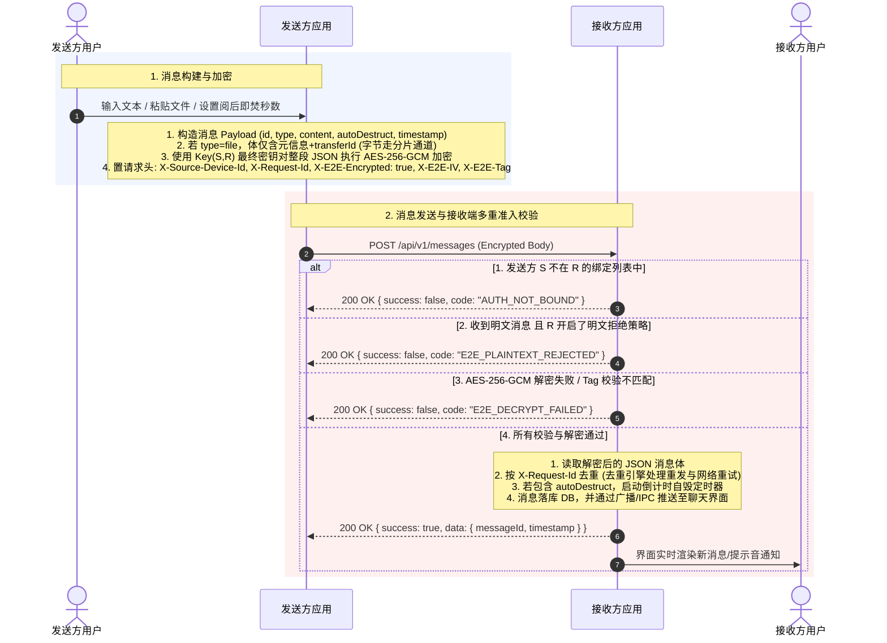
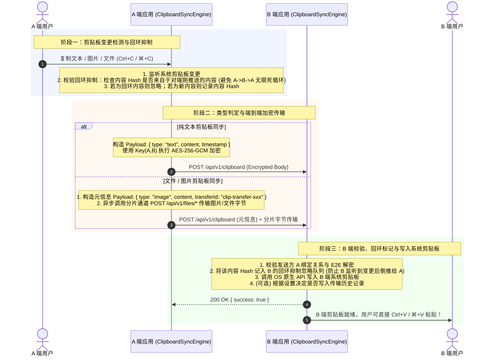
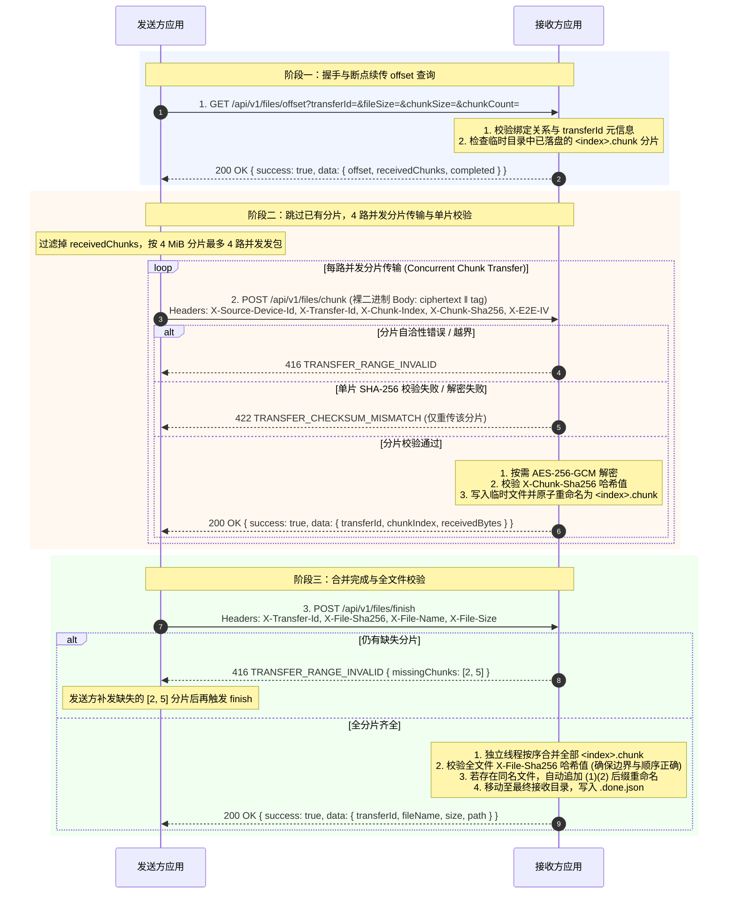
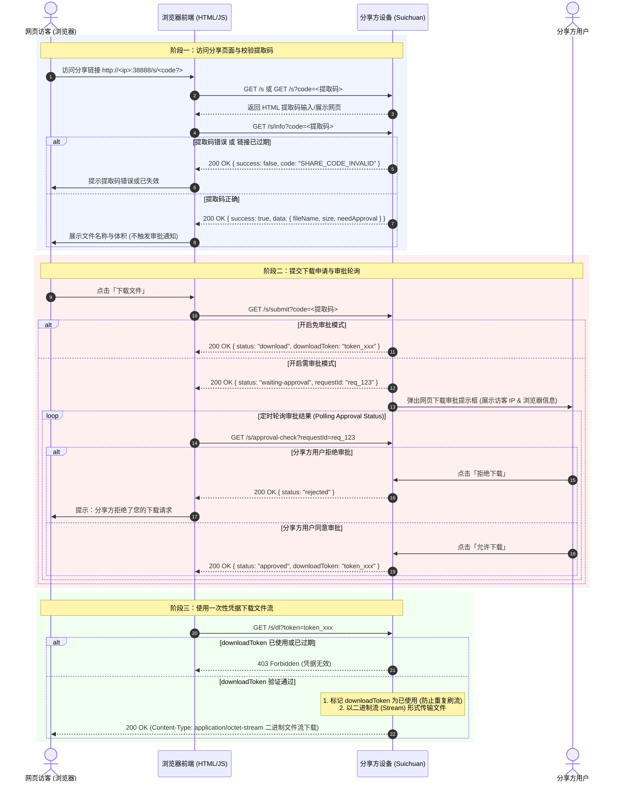

# 数据传输

## 目录

- [1. 概述](#1-概述)
- [2. 统一线格式](#2-统一线格式)
  - [2.1 请求构造与响应解析](#21-请求构造与响应解析)
  - [2.2 元数据只走请求头](#22-元数据只走请求头)
- [3. 端到端加密](#3-端到端加密)
  - [3.1 JSON 类请求](#31-json-类请求)
  - [3.2 文件分片](#32-文件分片)
  - [3.3 密钥校验](#33-密钥校验)
  - [3.4 明文接收策略](#34-明文接收策略)
- [4. 聊天消息](#4-聊天消息)
- [5. 剪贴板同步](#5-剪贴板同步)
- [6. 文件传输](#6-文件传输)
  - [6.1 参数](#61-参数)
  - [6.2 流程](#62-流程)
  - [6.3 两层校验](#63-两层校验)
  - [6.4 断点续传](#64-断点续传)
  - [6.5 业务场景区分](#65-业务场景区分)
- [7. 网页提取码分享](#7-网页提取码分享)
- [8. 阻塞与并发](#8-阻塞与并发)
- [9. 实现位置](#9-实现位置)

---

## 1. 概述

随传的业务数据分三类：聊天消息、剪贴板同步、文件传输。三类共用同一套线格式与端到端加密方案；文件字节统一走分片通道，消息与剪贴板中的文件仅携带元信息与 `transferId`。

接口定义见 [API.md](./API.md)。

---

## 2. 统一线格式

### 2.1 请求构造与响应解析

设备间请求统一发往 `http://<对端IP>:38888/api/v1/*`，响应使用统一信封 `ApiResponseEnvelope`：成功为 `{ success: true, data }`，失败为 `{ success: false, code, message?, details? }`。

请求构造与响应解析为跨端共享的纯函数，定义于 [`packages/protocol/src/client-request.ts`](../packages/protocol/src/client-request.ts)：

```
buildOutboundEnvelope()   →  { bodyString, headers }
parseResponseEnvelope()   →  { ok, status, code?, data?, details? }
```

各端的字节传输实现不同：pc 使用 Node `http`，app 使用 uni 原生 HTTP，pc-lite 使用 Rust `TcpStream`。拼装请求头、整体加密与解析信封三步共用上述纯函数。

### 2.2 元数据只走请求头

| Header | 说明 |
| :--- | :--- |
| `X-Source-Device-Id` | 发送方设备 ID，用于准入过滤，不作身份证明 |
| `X-Request-Id` | 请求关联 ID，接收端用于去重 |

`sourceDeviceId` 与 `requestId` 不写入 body。body 可能被整体加密，接收端在解密前即需读取这两项。

---

## 3. 端到端加密

### 3.1 JSON 类请求

消息与剪贴板请求对整段 body 加密，密文作为 body，信封置于请求头：

| 项 | 加密 | 明文 |
| :--- | :--- | :--- |
| `Content-Type` | `text/plain` | `application/json` |
| body | `base64(AES-256-GCM(整段 JSON))` | 明文 JSON |
| `X-E2E-Encrypted` | `true` | 不携带 |
| `X-E2E-IV` | base64(12 字节 IV) | — |
| `X-E2E-Tag` | base64(16 字节 Auth Tag) | — |

无会话密钥时自动回退为明文，由 `encryptBody` 返回 `null` 触发。

### 3.2 文件分片

分片为裸二进制流，不作 base64 编码：

| 项 | 加密 | 明文 |
| :--- | :--- | :--- |
| body | `ciphertext ‖ tag(16 字节)`，tag 追加于密文末尾 | 原始分片字节 |
| `X-E2E-IV` | base64(12 字节 IV) | 不携带 |
| `X-Chunk-Plain-Size` | 解密后明文字节数 | 分片字节数 |
| `Content-Length` | `X-Chunk-Plain-Size + 16` | 等于 `X-Chunk-Plain-Size` |

### 3.3 密钥校验

分片请求可携带 `X-E2E-Keycheck` 头，内容为 base64 编码的 `{iv, ciphertext, tag}` JSON，其明文为一段双方约定的固定校验串。

接收端先解密该段，据此区分「密钥不匹配」与「数据损坏」两种失败，并给出对应的界面提示。

### 3.4 明文接收策略

接收端默认仅接受加密数据。收到明文且未开启「允许接收不安全的数据」时，返回 `E2E_PLAINTEXT_REJECTED`（403）。

配对握手 `/api/v1/pair` 与身份认证 `/api/v1/auth` 本身为明文，不受此策略约束：前者发生在密钥建立之前，后者的凭据即为响应中的密文。

---

## 4. 聊天消息



- 去重：跨端重发与网络重试可能导致同一条消息重复到达，接收端按 `X-Request-Id`（或 body 内 `requestId`）去重，逻辑位于 [`packages/core/src/messaging/dedup.ts`](../packages/core/src/messaging/dedup.ts)。
- 阅后即焚：销毁时机由 [`packages/core/src/messaging/auto-destruct.ts`](../packages/core/src/messaging/auto-destruct.ts) 统一计算。
- 消息内文件：`type` 为 `file` 时消息体仅携带元信息与 `transferId`，字节走分片通道（见第 6 节）。

## 5. 剪贴板同步

### 5.1 同步流程



### 5.2 机制说明

- 文本直接置于 body；文件与图片仅携带元信息与 `transferId`，字节走分片通道。
- 同步引擎为跨端共享的 `ClipboardSyncEngine`（[`packages/domain/src/clipboard/`](../packages/domain/src/clipboard/)），负责变更检测、去重与回环抑制。回环抑制用于避免 A 同步至 B 的内容被 B 判定为本地变更后再次推回 A。
- 支持配置「自动写入剪贴板时不保留传输历史」。

---

## 6. 文件传输

### 6.1 参数

| 参数 | 值 | 常量 |
| :--- | :--- | :--- |
| 分片大小 | 4 MiB | `FILE_CHUNK_PROTOCOL.chunkSizeBytes` |
| 并发分片数 | 4 | `FILE_CHUNK_PROTOCOL.concurrency` |
| AES-GCM IV 长度 | 12 字节 | `FILE_CHUNK_PROTOCOL.aesGcmIvBytes` |
| AES-GCM Tag 长度 | 16 字节 | `FILE_CHUNK_PROTOCOL.aesGcmTagBytes` |

定义于 [`packages/protocol/src/file-chunk.ts`](../packages/protocol/src/file-chunk.ts)。

### 6.2 流程



### 6.3 两层校验

| 层级 | 校验对象 | 失败码 | 作用 |
| :--- | :--- | :--- | :--- |
| 分片 | `X-Chunk-Sha256` | `TRANSFER_CHECKSUM_MISMATCH`（422） | 单片损坏即时发现，仅需重传该片 |
| 全文件 | `X-File-Sha256` | `TRANSFER_CHECKSUM_MISMATCH`（422） | 合并后兜底，覆盖分片顺序与边界错误 |

此外校验分片布局的自洽性：`chunkCount` 等于 `ceil(fileSize / chunkSize)`、`chunkOffset` 等于 `chunkIndex × chunkSize`、末片大小正确、`Content-Length` 与声明一致。任一不符返回 `TRANSFER_RANGE_INVALID`（416）。

### 6.4 断点续传

已接收分片以 `<index>.chunk` 独立文件形式存放于临时目录，因此续传以分片为粒度：

- 重连后先请求 `/api/v1/files/offset` 获取 `receivedChunks`，仅补齐缺失分片；
- 若声明的布局（`fileSize`、`chunkSize`、`chunkCount`、来源设备）与已存元信息不一致，判定为不同文件复用了同一 `transferId`，接收端清空后重新开始；
- 传输完成写入 `.done.json`，重复调用 `finish` 幂等返回成功；
- 取消：`POST /api/v1/files/cancel` 置取消标记，进行中的分片写入随即中止。

### 6.5 业务场景区分

分片通道为通用二进制传输，三类业务共用。接收端按 `transferId` 前缀区分场景，前缀常量定义于 [`packages/core/src/utils/id.ts`](../packages/core/src/utils/id.ts)：

| 场景 | `transferId` 前缀 | 界面归属 |
| :--- | :--- | :--- |
| 设备直传文件 | `transfer-` | 传输中心与文件列表，独立进度条 |
| 聊天消息内文件 | `chat-transfer-` | 聊天气泡内的文件卡片，不计入传输历史 |
| 剪贴板文件与图片 | 由剪贴板流程携带 | 剪贴板同步列表 |

收发两端均以 `isChatTransferId()` 判定聊天文件，并将其排除在传输历史之外。

---

## 7. 网页提取码分享

面向未安装随传的浏览器，不依赖设备绑定：



`downloadToken` 为一次性凭据，使用后标记为已用，并设有过期时间。分享可配置为一次性，下载后自动失效。

核心逻辑位于 [`packages/share`](../packages/share/)，HTTP 适配位于 `packages/local-server/src/handlers/share.ts`。

---

## 8. 阻塞与并发

传输是全仓库阻塞 I/O 最密集的部分，两条硬性规则（完整清单见 [conventions.md 第 4 节](./conventions.md#4-并发与阻塞)）：

1. 持有数据库锁期间不执行网络 I/O。锁的作用域覆盖取密钥与加密两步；对端不可达时该锁若被占用至超时，全部数据库读写、心跳轮询与后台扫描将一并阻塞。
2. 阻塞调用不占用异步运行时的 worker。并发若干不可达目标即可占满 worker，使全部 IPC 无法排入。

文件合并、SHA-256 计算等 CPU 与 IO 密集操作置于独立线程，不阻塞 UI 事件循环。

---

## 9. 实现位置

| 端 | 服务端（接收） | 客户端（发送） |
| :--- | :--- | :--- |
| pc | `pc/src/main/network/httpServer.ts` | `pc/src/main/network/api/*` 与 `services/fileTransfer.ts` |
| pc-lite | `pc-lite/src-tauri/src/http_server/handlers.rs` | `pc-lite/src-tauri/src/file_transfer.rs` |
| app | `app/src/service/httpServer.ts` | `app/src/api/*` 与 `app/src/service/transfer.ts` |

跨端共享：`@suichuan/protocol`（线格式、分片头、错误码）、`@suichuan/local-server`（入站解密、流式分片器、路径清洗）、`@suichuan/domain/transfer`（传输编排、进度与停滞检测）、`@suichuan/crypto`（AES-GCM、HKDF、X25519）。
