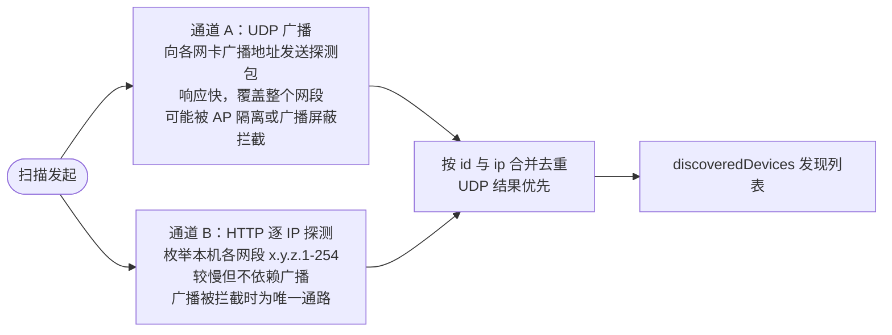
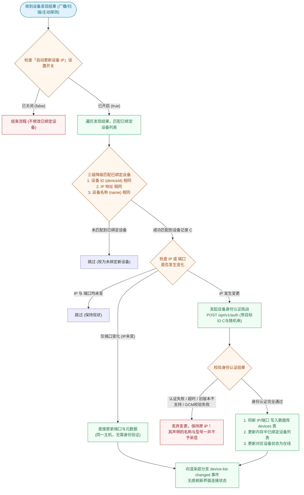

# 局域网设备发现

## 目录

- [1. 概述](#1-概述)
- [2. 端口与报文](#2-端口与报文)
  - [2.1 端口分配](#21-端口分配)
  - [2.2 UDP 报文](#22-udp-报文)
  - [2.3 HTTP 探测](#23-http-探测)
- [3. 双通道扫描](#3-双通道扫描)
  - [3.1 通道构成](#31-通道构成)
  - [3.2 各端参数](#32-各端参数)
  - [3.3 网卡筛选](#33-网卡筛选)
- [4. 扫描触发与调度](#4-扫描触发与调度)
- [5. 已绑定设备的 IP 跟随](#5-已绑定设备的-ip-跟随)
- [6. 在线状态判定](#6-在线状态判定)
- [7. 隐身模式](#7-隐身模式)
- [8. 实现位置](#8-实现位置)

---

## 1. 概述

随传不依赖任何中心服务器完成设备发现。发现流程承担两项职责：

1. 找出局域网内其它随传设备，供用户选择并配对；
2. 跟踪已绑定设备的地址变化，在 IP 变更后恢复可达性。

在线与否不由发现流程判定，而由心跳独立负责，两者职责分离（见第 6 节）。

---

## 2. 端口与报文

### 2.1 端口分配

| 用途 | 协议 | 端口 | 常量 |
| :--- | :--- | :--- | :--- |
| 本地 HTTP API（探测与业务） | TCP | 38888 | `DEFAULT_API_PORT` |
| 设备发现广播 | UDP | 38890 | `DEFAULT_DISCOVERY_PORT` |

常量定义于 [`packages/core/src/discovery/announce-packet.ts`](../packages/core/src/discovery/announce-packet.ts)。

### 2.2 UDP 报文

探测包以广播方式发出，两种形式等效：

```
SUICHUAN_DISCOVER            裸文本
{"type":"discover"}          JSON
```

应答包以单播回发至来源 `addr:port`：

```json
{
  "type": "SUICHUAN_RESPONSE",
  "device": {
    "id": "device-...", "name": "...", "type": "computer",
    "platform": "macOS", "ip": "192.168.1.10", "port": 38888, "version": "1.0.16"
  }
}
```

扫描方以实际收到应答的源地址作为设备地址（UDP 取 `src.ip()`，HTTP 取被探测地址），`device.ip` 不参与该判定。

### 2.3 HTTP 探测

请求 `GET /api/v1/info`，判定依据为响应中 `service` 等于 `suichuan`。隐身模式下该接口返回 404。

---

## 3. 双通道扫描

### 3.1 通道构成

三端均采用 UDP 广播与 HTTP 逐 IP 探测双通道，两路结果合并去重，UDP 结果优先：



部分路由器与企业 AP 启用客户端隔离或屏蔽广播，此时通道 A 失效；较大网段下仅通道 B 的发现耗时显著上升。两路并行，以先到结果为准。

### 3.2 各端参数

| 端 | UDP 广播 | HTTP 探测并发 | 单点探测超时 |
| :--- | :--- | :--- | :--- |
| pc (Electron) | 广播地址与定向广播地址 | 192 | 见 `pc/src/main/network/discovery/constants.ts` |
| pc-lite (Tauri) | 2 轮广播，2s 接收窗口 | 64 线程 | 350ms |
| app (uni-app) | 原生 UDP 广播 | 原生全并发扫描 | 单轮扫描 5s |

广播目标不限于 `255.255.255.255`：另需按各网卡计算定向广播地址（如 `192.168.1.255`）及网段级兜底地址，因为不同系统与路由设备对全局广播的处理并不一致。

### 3.3 网卡筛选

扫描仅从真实局域网网卡发起，跳过虚拟与隧道网卡（loopback、docker、veth、vmnet、tun/utun、VPN、Tailscale、WSL、vEthernet、蓝牙、AWDL 等），并按下列优先级排序：

优先级由高到低：热点接口、Wi-Fi 与有线、蜂窝与 VPN 与 USB 网络共享。

移动端同时存在 Wi-Fi 与蜂窝网卡时，选取 Wi-Fi 对应的私网地址；选中蜂窝地址时同网设备之间无法互相访问。

判定逻辑集中于 [`packages/local-server/src/ip-utils.ts`](../packages/local-server/src/ip-utils.ts)，包含私网段、CGNAT、link-local 与虚拟网卡名判定。

---

## 4. 扫描触发与调度

| 触发源 | 说明 |
| :--- | :--- |
| 应用启动 | 启动后延迟数秒执行首次扫描 |
| 后台定时 | 间隔由「自动扫描间隔」设置决定，默认 30s，受「自动扫描局域网设备」开关控制 |
| 用户手动 | 设备页触发 |
| 手动输入 IP | 仅对指定 `ip:port` 发送一次 `/api/v1/info`，不执行网段扫描 |

扫描为单例。后台定时与用户手动共用同一个进行中的扫描任务：用户在后台扫描进行中触发手动刷新时，界面接入当前进度继续推进，不中断重新开始。

进度与结果通过事件流实时推送（`scan-start`、`scan-progress`、`discovered-device`、`scan-end`），发现列表在扫描过程中持续刷新，无需等待整轮结束。

---

## 5. 已绑定设备的 IP 跟随

设备 IP 会因 DHCP 续租或网络切换而变化，扫描结果需与绑定列表比对并更新。但发现数据中的 `id` 与 `name` 由对端自行声明，直接采信等同于将设备指向任何声称持有该身份的主机。

因此流程如下：



身份认证细节见 [identity-auth.md](./identity-auth.md)。配套接线：

1. 渲染层不修改 IP。写库由主进程（pc、pc-lite）或 store 单一函数（app）在验证通过后执行，随后通过事件推送界面，IP 更新入口唯一。
2. 后台扫描与手动扫描共用同一条同步逻辑。
3. 匹配优先级为设备 ID、IP、设备名。后两者为兜底，用于对端重装导致 ID 变化的历史数据；兜底命中时验证使用所匹配绑定记录的 ID，冒充者无对应密钥，验证不通过。
4. 用户在设备详情中手动修改的 IP 不经验证。

pc 端另有一个 IP 变更触发源，即入站请求暴露的对端 socket 地址，同样经身份认证，详见 [identity-auth.md 第 7 节](./identity-auth.md#7-与-ip-更新的接线方式)。

---

## 6. 在线状态判定

在线状态由心跳独立判定，与发现流程解耦。

| 参数 | 值 | 常量 |
| :--- | :--- | :--- |
| 心跳间隔 | 3s | `HEARTBEAT_INTERVAL_MS` |
| 单次探测超时 | 1.5s | `HEARTBEAT_TIMEOUT_MS` |
| 判定离线的连续失败次数 | 2 | `HEARTBEAT_FAILURE_THRESHOLD` |

上述常量定义于 `packages/protocol/src/messages/heartbeat.ts`。心跳请求 `GET /api/v1/heartbeat`。判定规则复用 [`packages/core/src/state-machines/heartbeat.ts`](../packages/core/src/state-machines/heartbeat.ts) 的纯状态机，pc 与 app 共享同一份实现：

| 当前状态 | 探测结果 | 转移结果 |
| :--- | :--- | :--- |
| 初始 `unknown` | — | 离线（启动时默认不在线，避免展示上次退出时的残留状态） |
| 任意 | 成功 | 在线 |
| 从未成功过 | 失败 | 直接离线，无宽限 |
| 曾经在线 | 失败 1 次 | flapping，仍视为在线，用于平滑单次抖动 |
| 曾经在线 | 连续失败 2 次 | 离线 |

心跳仅判定在线状态，不修改 IP。心跳结果来自旧 IP（该 IP 已被扫描更新）时，该结果被丢弃。

---

## 7. 隐身模式

启用隐身后，设备对发现流程表现为不存在：

- `GET /api/v1/info` 返回 `ROUTE_NOT_FOUND`（404）；
- 不响应 UDP 探测包。

已绑定设备之间的业务通信（消息、文件、剪贴板）不受影响。隐身仅影响被发现能力，不影响已建立的信任关系。相应地，隐身设备自身的 IP 变更也无法被对端通过扫描获知。

---

## 8. 实现位置

| 端 | 扫描 | UDP 应答 | IP 同步 |
| :--- | :--- | :--- | :--- |
| pc | [`pc/src/main/network/deviceDiscovery.ts`](../pc/src/main/network/deviceDiscovery.ts) | 同文件 | [`pc/src/main/network/heartbeat.ts`](../pc/src/main/network/heartbeat.ts) 的 `reconcileDiscoveredIPs` |
| pc-lite | [`pc-lite/src-tauri/src/discovery.rs`](../pc-lite/src-tauri/src/discovery.rs) 的 `scan_lan` | 同文件 `start_responder` | 同文件 `reconcile_discovered_ips` |
| app | [`app/src/service/discovery.ts`](../app/src/service/discovery.ts) | [`app/src/service/udpDiscovery.ts`](../app/src/service/udpDiscovery.ts) | [`app/src/store/device.ts`](../app/src/store/device.ts) 的 `updateBoundFromDiscovered` |

跨端共享部分：`@suichuan/domain/discovery`（DiscoveryEngine、LanScanner）与 `@suichuan/local-server/ip-utils`。
