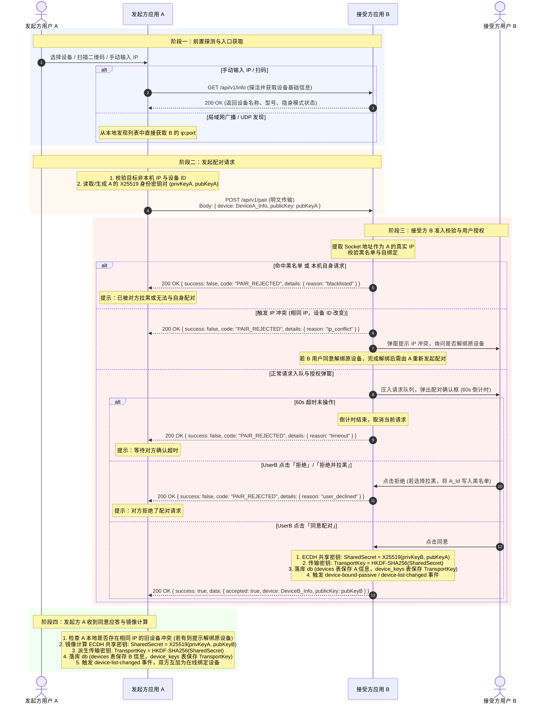

# 设备配对与绑定

## 目录

- [1. 概述](#1-概述)
- [2. 机制要点](#2-机制要点)
- [3. 配对流程](#3-配对流程)
  - [3.1 时序](#31-时序)
  - [3.2 密钥派生](#32-密钥派生)
- [4. 建立连接的三种入口](#4-建立连接的三种入口)
- [5. IP 冲突处理](#5-ip-冲突处理)
- [6. 绑定关系的作用](#6-绑定关系的作用)
- [7. 解绑与黑名单](#7-解绑与黑名单)
- [8. 实现位置](#8-实现位置)

---

## 1. 概述

配对（pairing）指两台设备建立信任关系的过程，完成后双方互为「已绑定设备」，可交换消息、剪贴板与文件。配对同时完成一次 X25519 密钥协商，为后续端到端加密与身份认证提供会话密钥。

---

## 2. 机制要点

| 项 | 说明 |
| :--- | :--- |
| 不使用安全码 | 配对授权依赖对端弹窗人工确认，不在两台设备间转录数字串 |
| 密钥协商无条件执行 | 无论「端对端加密」开关是否开启，配对时均完成 X25519 协商并落库。该开关仅控制业务数据是否加密传输，不影响握手 |
| 绑定为双向关系，各自存储一份 | 双方分别将对端写入本机绑定列表。解绑仅影响本机记录，对端在后续请求中通过 `AUTH_NOT_BOUND` 获知 |
| 以设备 ID 作为稳定标识 | 以对端返回的 `deviceId` 为准，IP 不作身份标识 |

---

## 3. 配对流程

### 3.1 时序与分支流程

发起方记为 **A**，接受方记为 **B**。完整配对流程覆盖入口探测、自绑定校验、黑名单过滤、IP 冲突处理、抢占队列、用户确认弹窗（含 60s 超时与拒绝/拉黑分支）、双向 ECDH 密钥派生与状态同步：

全程仅交换公钥，密钥由双方各自通过 ECDH 计算得出，不在网络上出现。

### 3.2 密钥派生

| 层级 | 长度 | 派生方式 | 存储 |
| :--- | :--- | :--- | :--- |
| 共享密钥 | 32 字节 | `X25519(本机私钥, 对端公钥)` | 不落库，双方各自算出，不经网络 |
| 传输密钥 | 32 字节 | `HKDF-SHA256(共享密钥, …)` | 写入 `device_keys` |
| 最终密钥 | 32 字节 | `HKDF-SHA256(传输密钥, …)`，混入应用内置密钥与用户端对端加密私人密钥 | 不落库，用时派生 |

业务数据加解密与身份认证均使用最终密钥。数据库中仅存传输密钥。相关说明见 [identity-auth.md 第 4.1 节](./identity-auth.md#41-密钥)。

派生所用的具体盐与 info 常量、以及内置密钥不在文档中列出，实现见 [`packages/crypto/src/ecdh.ts`](../packages/crypto/src/ecdh.ts)。三端取值逐字节一致。

本机 X25519 身份密钥对在首次需要时惰性生成并写入 `identity_keys` 表，此后复用。

---

## 4. 建立连接的三种入口

| 入口 | 流程 |
| :--- | :--- |
| 扫描发现后绑定 | 从发现列表选择设备，发送 `/api/v1/pair`，对端弹窗确认 |
| 扫码绑定 | 二维码携带对端 `ip:port` 等信息，扫码后走同一套 `/api/v1/pair` |
| 手动输入 IP 绑定 | 先对 `ip:port` 发送 `/api/v1/info` 确认为随传服务，再走 `/api/v1/pair` |

三者的差异仅在于获取对端地址的方式，配对握手一致。

---

## 5. IP 冲突处理

配对时若检测到目标 IP 已绑定另一台设备（`deviceId` 不同但 IP 相同，通常源于对端重装应用导致 ID 变化），弹窗由用户决定：

- 解绑原设备后继续，可选择同时清空与原设备的聊天记录、传输记录及已接收文件；
- 或放弃本次绑定。

不执行静默覆盖，避免用户的历史数据在无提示的情况下指向另一台设备。

---

## 6. 绑定关系的作用

绑定列表是入站业务请求的准入依据。服务端对 `/api/v1/messages`、`/api/v1/clipboard`、`/api/v1/files/*` 一律先校验请求头 `X-Source-Device-Id` 是否属于绑定列表，不属于则返回 `AUTH_NOT_BOUND`（403）。

`X-Source-Device-Id` 为明文，仅用于准入过滤。基于身份作出安全决策的场合（典型为 IP 更新）执行[身份认证](./identity-auth.md)；数据自身的真实性由端到端加密的认证标签保证。

不受绑定关系约束的接口：

| 接口 | 原因 |
| :--- | :--- |
| `/api/v1/info`、`/api/v1/heartbeat` | 发现与存活探测，本身公开；隐身模式下 `info` 返回 404 |
| `/api/v1/pair` | 配对时尚无绑定关系 |
| `/api/v1/auth` | 应答方先读取 `sourceDeviceId` 才能确定使用哪把密钥，该接口自身校验绑定关系 |
| `/s/*` 网页提取码分享 | 面向未安装应用的浏览器，依据提取码与审批而非设备绑定 |

---

## 7. 解绑与黑名单

解绑由任一方发起，执行三步：

1. 从绑定列表移除该设备；
2. 删除对应的 `device_keys` 记录，销毁会话密钥；
3. 通知界面刷新；可选同时清空该设备的聊天记录、传输记录与已接收文件。

对端在下一次请求时收到 `AUTH_NOT_BOUND`，或在身份认证时被拒绝。密钥已删除，对方持有的旧密钥无法通过任何认证。

黑名单：拒绝配对时可选择加入黑名单，此后该 `deviceId` 的配对请求直接返回 `PAIR_BLACKLISTED`，不再触发弹窗。

---

## 8. 实现位置

| 端 | 应答方（被配对） | 发起方 |
| :--- | :--- | :--- |
| 共享逻辑 | [`packages/local-server/src/pairing-service.ts`](../packages/local-server/src/pairing-service.ts)，含决策与 ECDH 派生，无 I/O | [`packages/domain/src/pairing/`](../packages/domain/src/pairing/) |
| pc | `pc/src/main/network/httpServer.ts` 的 `handlePair`，复用 `PairingService` | `pc/src/main/network/api/device.ts` 的 `pair()` |
| pc-lite | `pc-lite/src-tauri/src/http_server/handlers.rs` 的 `handle_pair` | `pc-lite/src-tauri/src/ipc/mod.rs` 的 `send-pair-request` |
| app | `app/src/service/httpServer.ts` 的 `/api/v1/pair` 路由 | `app/src/api/device.ts` 的 `pair()` |

密钥协商基元统一位于 [`packages/crypto`](../packages/crypto/)（`ecdh.ts`、`session.ts`）。pc-lite 在 Rust 侧实现，为按同一 HKDF 参数的等价实现。
