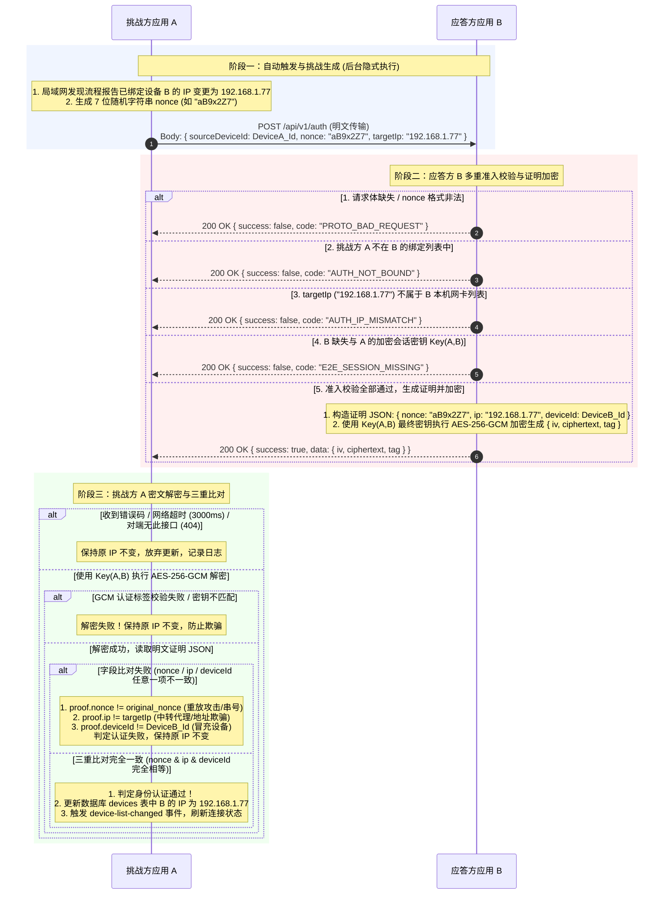

# 设备身份认证

## 目录

- [1. 概述](#1-概述)
- [2. 适用场景](#2-适用场景)
- [3. 协议流程](#3-协议流程)
  - [3.1 时序](#31-时序)
  - [3.2 字段定义](#32-字段定义)
- [4. 协议要点](#4-协议要点)
  - [4.1 密钥](#41-密钥)
  - [4.2 证明的字段构成](#42-证明的字段构成)
  - [4.3 随机串比对](#43-随机串比对)
- [5. 失败语义](#5-失败语义)
- [6. 三端实现](#6-三端实现)
  - [6.1 实现位置](#61-实现位置)
  - [6.2 应答方的注入项](#62-应答方的注入项)
- [7. 与 IP 更新的接线方式](#7-与-ip-更新的接线方式)
- [8. 并发与时序](#8-并发与时序)

---

## 1. 概述

设备身份认证用于一台设备向另一台设备证明自身身份，过程中不传输密钥材料。机制为基于共享会话密钥的挑战-应答。

接口定义见 [API.md 第 3.5 节](./API.md#35-post-apiv1auth)。相关代码：

| 职责 | 位置 |
| :--- | :--- |
| 线格式契约 | [`packages/protocol/src/messages/auth.ts`](../packages/protocol/src/messages/auth.ts) |
| 应答方（被挑战） | [`packages/local-server/src/handlers/auth.ts`](../packages/local-server/src/handlers/auth.ts) |
| 挑战方（发起） | [`packages/domain/src/auth/identity-verifier.ts`](../packages/domain/src/auth/identity-verifier.ts) |

---

## 2. 适用场景

当前的调用点为已绑定设备的 IP 变更：发现流程报告某台已绑定设备出现在新地址时，先执行身份认证，通过后才更新该设备的 IP。

设备发现响应中的 `id` 与 `name` 由对端自行声明，入站请求头 `X-Source-Device-Id` 同为明文，两者均不足以判定对端身份。攻击者在同一局域网内冒充某个 deviceId 应答一次扫描，即可使受害者将已绑定设备的 IP 改写为攻击者地址，此后消息、剪贴板与文件均发往攻击者。

该流程为通用机制，其它需要确认「对端是某台已绑定设备」的场合复用同一接口。

---

## 3. 协议流程

### 3.1 时序与分支流程

挑战方记为 **A**，应答方记为 **B**。完整身份认证流程覆盖触发条件、挑战发送、应答方多重准入校验（含非法格式、未绑定、IP 不匹配、密钥缺失分支）、AES-256-GCM 加密证明生成、以及挑战方的 GCM 解密与三重字段比对（nonce、ip、deviceId）：



### 3.2 字段定义

| 字段 | 方向 | 说明 |
| :--- | :--- | :--- |
| `sourceDeviceId` | A → B | 挑战方设备 ID。应答方用其在绑定列表中定位对端并取出会话密钥 |
| `nonce` | A → B | 一次性随机串，固定 7 位 `[0-9a-zA-Z]` |
| `targetIp` | A → B | 挑战方认为应答方所处的地址。应答方校验该地址是否属于本机 |
| `data.iv` / `ciphertext` / `tag` | B → A | AES-256-GCM 信封，明文为下述证明 JSON |
| `proof.nonce` | 密文内 | 原样回显挑战串 |
| `proof.ip` | 密文内 | 应答方已确认属于本机的地址 |
| `proof.deviceId` | 密文内 | 应答方自身的设备 ID |

---

## 4. 协议要点

### 4.1 密钥

加解密使用最终密钥，与消息、文件传输一致：

| 层级 | 派生方式 | 存储 |
| :--- | :--- | :--- |
| 共享密钥 | `X25519(本机私钥, 对端公钥)` | 不落库，配对时协商，不经网络 |
| 传输密钥 | `HKDF(共享密钥, …)` | 落库到 `device_keys` |
| 最终密钥 | `HKDF(传输密钥, …)`，混入应用内置密钥与用户端对端加密私人密钥 | 不落库，用时派生 |

落库的传输密钥不用于本流程。传输密钥可随数据库文件一同泄露；最终密钥额外混入的两段材料均不在数据库内，一段随应用分发，一段仅存于用户侧配置。

具体盐与 info 常量不在文档中列出，实现见 [`packages/crypto/src/ecdh.ts`](../packages/crypto/src/ecdh.ts)。

两端的私人密钥设置一致时验证通过。设置不一致时验证失败，此状态下双方本就无法收发加密数据，IP 亦不更新。

### 4.2 证明的字段构成

证明包含 `nonce`、`ip`、`deviceId` 三项。

仅回显 `nonce` 时存在中转路径：攻击者 M 将 A 的挑战原样转发给真实设备 B，再将 B 的应答回送 A，即可将 B 的身份绑定到 M 的地址。加入 `ip` 后该路径的两个分支均被阻断：

| 攻击者行为 | 结果 |
| :--- | :--- |
| 原样转发，`targetIp` 为 M 的地址 | B 判定该地址不属于本机，返回 `AUTH_IP_MISMATCH` |
| 将 `targetIp` 改写为 B 的真实地址 | B 应答中的 `ip` 为 B 的地址，与 A 的候选地址不符，A 判定不通过 |
| 篡改密文中的 `ip` | GCM 认证标签校验失败，解密阶段即失败 |

`deviceId` 对应另一台已绑定设备的冒充路径：设备 C 与 A 互绑并持有密钥 K(A,C)，其应答以 K(A,C) 加密，A 以 K(A,B) 无法解密；即使解密成功，`deviceId` 为 C 而非 B。

### 4.3 随机串比对

`nonce` 由 A 以明文发出，比对采用普通字符串相等判断。认证强度来自 GCM 认证标签。

---

## 5. 失败语义

全部失败路径的处理方式一致：保持现状，不更新 IP。

| 条件 | 错误码 |
| :--- | :--- |
| 请求体不合法（字段缺失、`nonce` 格式不符） | `PROTO_BAD_REQUEST` |
| 挑战方已不在应答方的绑定列表中 | `AUTH_NOT_BOUND` |
| `targetIp` 不属于应答方本机地址 | `AUTH_IP_MISMATCH` |
| 绑定关系存在但无会话密钥 | `E2E_SESSION_MISSING` |
| 网络不可达或超时（3000ms） | 无响应 |
| 解密失败或证明字段不匹配 | 无（本地判定） |
| 对端为无此接口的旧版本 | `ROUTE_NOT_FOUND` / HTTP 404 |

最后一项在日志中按普通信息记录，其余按告警级别记录。旧版本对端的表现为不产生错误，同时不更新 IP。

---

## 6. 三端实现

### 6.1 实现位置

| 端 | 应答方 | 挑战方 |
| :--- | :--- | :--- |
| app (uni-app) | [`app/src/service/httpServer.ts`](../app/src/service/httpServer.ts) 的 `/api/v1/auth` 路由 | [`app/src/service/identityAuth.ts`](../app/src/service/identityAuth.ts) |
| pc (Electron) | [`pc/src/main/network/httpServer.ts`](../pc/src/main/network/httpServer.ts) 的 `handleIdentityChallenge` | [`pc/src/main/services/identityAuth.ts`](../pc/src/main/services/identityAuth.ts) |
| pc-lite (Tauri) | [`pc-lite/src-tauri/src/identity_auth.rs`](../pc-lite/src-tauri/src/identity_auth.rs) 的 `handle_auth` | 同文件 `verify_peer_identity` |

app 与 pc 的判定逻辑位于共享包 `@suichuan/local-server` 与 `@suichuan/domain/auth`，各端注入传输与密钥实现。pc-lite 的加解密在 Rust 侧，为按同一契约的等价实现，字段名、错误码与随机串规则逐一对齐。

### 6.2 应答方的注入项

```ts
handleIdentityAuth(body, {
  selfDeviceId,   // 本机设备 ID，写入证明
  localIps,       // 本机全部真实 IPv4 地址
  isBound,        // 对端是否仍在绑定列表中
  encryptForPeer  // 以最终密钥加密；无会话密钥时返回 null
})
```

`localIps` 取本机真实持有的全部 IPv4 地址，而非面向展示或对外通告的过滤后列表。展示用列表会滤除公网段、CGNAT 以及 docker、WSL、vEthernet 等虚拟网卡地址；对端记录的是其探测到本机的那个地址，可能属于被滤除的范围，例如使用公网 IPv4 编址的校园或企业局域网。对应实现为 pc 的 `getAllLocalIPv4()` 与 pc-lite 的 `all_local_ipv4()`，两者仅包含本机自身持有的地址。

---

## 7. 与 IP 更新的接线方式

IP 更新入口唯一，具体接线如下：

1. 渲染层与 UI 层不直接修改已绑定设备的 IP。写库由主进程（pc、pc-lite）或 store 的单一函数（app）在验证通过后执行，随后通过事件将结果推送至界面。
2. 后台定时扫描与用户手动扫描共用同一条同步逻辑。
3. 同一 IP 上仅端口变化时不执行验证，仍为同一主机；IP 变化时连同端口一并验证后写入。
4. 用户在设备详情中手动填写的 IP 不经验证。

各端的写入入口：

| 端 | 唯一入口 |
| :--- | :--- |
| app | `useDeviceStore` 的 `updateBoundFromDiscovered()` |
| pc | [`pc/src/main/network/heartbeat.ts`](../pc/src/main/network/heartbeat.ts) 的 `verifyAndApplyDeviceIp()` |
| pc-lite | [`pc-lite/src-tauri/src/discovery.rs`](../pc-lite/src-tauri/src/discovery.rs) 的 `reconcile_discovered_ips()` |

pc 端存在第二个触发源：入站请求暴露的对端 socket 地址（`notifyDeviceIPUpdate`）。其 deviceId 取自请求头，同样经身份认证。该路径位于文件分片热路径上，实现中设置了两级约束：地址未变化时直接返回；验证失败后进入 30s 冷却。

---

## 8. 并发与时序

1. 单轮扫描中同一设备可能由单播探测、UDP 应答与批量收尾重复触发。挑战方按 `deviceId|ip` 对进行中的请求去重，同目标并发共用同一次请求。
2. 挑战串每次重新生成，取自系统 CSPRNG（pc、pc-lite）或 crypto provider（app）。
3. 验证为异步操作。返回后重新确认设备仍在绑定列表中再写库，等待期间用户可能已执行解绑。
